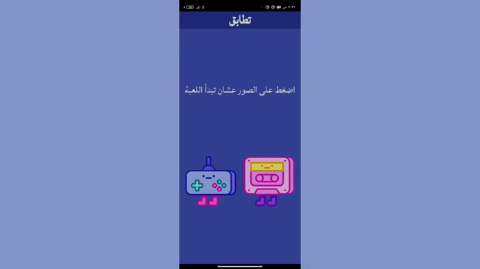

# Flutter tataboq app  (Image Matching Game)

This is a simple Flutter game where users click on images to see if they match. The game displays a congratulatory message if the images match, and asks the user to try again if they don't.

## Features

- Randomly generates two images on the screen.
- Displays a message to the user based on whether the images match or not.
- Animates the message text every time the user clicks on an image.
- Simple and clean UI with responsive font size based on screen size.

## Video
